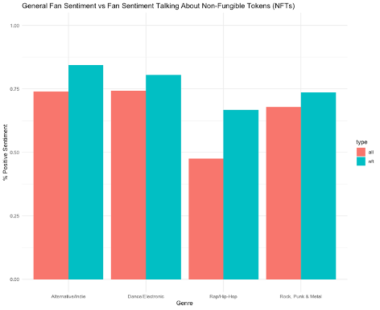

```{r, results = FALSE, message = FALSE, warning = FALSE}
library(rtweet)
library(tidytext)
library(tidyr)
library(ggplot2)
library(plotly)
library(tidyverse)
require(httr)
require(jsonlite)
require(dplyr)
library(wesanderson)
library(readxl)
```

```{r, echo = FALSE}
drop_tbl <- read_excel("~/Documents/Dietrich_Capstone/datasets/drop_tbl.xlsx")
```


## Scraping & Analyzing for NFT Drops


```{r,eval = FALSE}
#Tracking NFT Drops

 ##   Rock, Punk, Metal
tmls <- get_timelines(c("Korn", "TheOfficialA7X", "MatchboxTwenty", "Weezer"), n = 3200)
unique(tmls$created_at)
t <- tmls %>%
  filter(created_at > "2021-01-01") %>%
  filter(grepl('NFT|nft|crypto', text)) %>%
  mutate(genre = "Rock, Punk, & Metal", .before = user_id)
glimpse(t)
t.2 <- t%>%
  mutate_at(vars(c("quote_count", "reply_count")), ~replace_na(.,0)) %>%
  group_by(status_id) %>%
  mutate(traction = retweet_count + favorite_count + quote_count + reply_count) %>%
  select(traction,retweet_count,favorite_count,quote_count,reply_count, everything())
ggplot(t.2, aes(x=created_at, y = traction)) +
  geom_point() +
  scale_x_continuous(trans = "log")

 ##   Alternative/Indie
tmls_alt <- get_timelines(c("KingsOfLeon", "pussyrrriot", "imogenheap", "mikeshinoda"), n = 350)
t_alt <- tmls_alt %>%
  filter(created_at > "2021-01-01") %>%
  filter(grepl('NFT|nft|crypto', text)) %>%
  mutate(genre = "Alternative/Indie", .before = user_id)
glimpse(t_alt)
 
 ##   Rap/Hip-Hop
tmls_hp <- get_timelines(c("asvpxrocky", "mickjenkins", "MFDOOM", "SnoopDogg"), n = 350)
 t_hp <- tmls_hp %>%
   filter(created_at > "2021-01-01") %>%
   filter(grepl('NFT|nft|crypto', text)) %>%
   mutate(genre = "Rap/Hip-Hop", .before = user_id)
 glimpse(t_hp)
 
 ##   Dance & Electronic
tmls_edm <- get_timelines(c("3LAU", "deadmau5", "steveaoki", "Grimezsz"), n = 3200)
 t_edm <- tmls_edm %>%
   filter(created_at > "2021-01-01") %>%
   filter(grepl('NFT|nft|crypto', text)) %>%
   mutate(genre = "Dance & Electronic", .before = user_id)
 glimpse(t_edm)
 
 ##   Combining all datasets, then manipulating
 drop_tbl <- rbind(t, t_alt, t_hp, t_edm)
 drop_tbl <- drop_tbl %>%
 mutate_at(vars(c("quote_count", "reply_count")), ~replace_na(.,0)) %>%
  group_by(status_id) %>%
  mutate(traction = retweet_count + favorite_count + quote_count + reply_count) %>%
  select(traction,retweet_count,favorite_count,quote_count,reply_count, everything())
 
```


## Interactive Visuals Representing NFT Drops:


```{r}

drop_tbl <- drop_tbl %>%
mutate_at(vars(c("quote_count", "reply_count")), ~replace_na(.,0)) %>%
  group_by(status_id) %>%
  mutate(traction = retweet_count + favorite_count + quote_count + reply_count) %>%
  select(traction,retweet_count,favorite_count,quote_count,reply_count, everything())

#Making tooptip for interactivity
drop_tbl <- drop_tbl %>%
  mutate(tt = paste0("Artist: ", screen_name,
                     "\nGenre: ", genre,
                     "\nDate: ", created_at,
                     "\nTraction: ", traction))

#red, blue, yellow, black
rc_pal = colorRampPalette(c("#ffd460", "#bdbdbd", "#6098ff","#252525"))


# edit scale
final_tbl <- ggplot(drop_tbl, aes(x=created_at, y = traction, 
                            color = genre,
                            text = tt)) +
  geom_point() +
  labs(title = "NFT Drops By Genre",
       x = "Date",
       y = "Traction") + 
  scale_color_manual(name = "Genre", values = rc_pal(4)) + 
  ylim(0,10500) +
  theme_minimal() 

#interactive plot
ggplotly(final_tbl, tooltip = "text")


```

```{r, echo = FALSE}
drop_tbl_2 <- drop_tbl %>%
  filter(genre != "Dance & Electronic")

drop_tbl_2 <- drop_tbl_2 %>%
mutate_at(vars(c("quote_count", "reply_count")), ~replace_na(.,0)) %>%
  group_by(status_id) %>%
  mutate(traction = retweet_count + favorite_count + quote_count + reply_count) %>%
  select(traction,retweet_count,favorite_count,quote_count,reply_count, everything())

#Making tooptip for interactivity
drop_tbl_2 <- drop_tbl_2 %>%
  mutate(tt = paste0("Artist: ", screen_name,
                     "\nDate: ", created_at,
                     "\nGenre: ", genre,
                     "\nTraction: ", traction))

#red, blue, yellow, black
rc_pal = colorRampPalette(c("#ffd460", "#6098ff","#252525"))


# edit scale
final_tbl <- ggplot(drop_tbl_2, aes(x=created_at, y = traction,
                            color = genre,
                            text = tt)) +
  geom_point() +
  labs(title = "NFT Drops By Genre",
       x = "Date",
       y = "Traction") +
  scale_color_manual(name = "Genre", values = rc_pal(3)) +
  ylim(0,10500) +
  theme_minimal()

#interactive plot
ggplotly(final_tbl, tooltip = "text")


```


## Scraping & Analyzing For Fan Setiment


```{r, eval = FALSE}

####
## Scraping for fan tweets 
###


 ########## Rock, Punk & Metal
 
 all_weezer <- search_tweets("@Weezer", n=1000, include_rts = FALSE)
 band <- "@Weezer"
 terms <- c("NFT", "crypto", "nft")
 or_terms <- paste(terms, collapse =" OR ")
 search <- paste(band, or_terms, sep = " AND ")
 nft_weezer <- search_tweets(search, n=500, include_rts = FALSE)
 
 all_korn <- search_tweets("@Korn", n = 1000, include_rts = FALSE, lang = "en")
 band <- "@Korn"
 terms <- c("NFT", "crypto", "nft")
 or_terms <- paste(terms, collapse =" OR ")
 search <- paste(band, or_terms, sep = " AND ")
 nft_korn <- search_tweets(search, n = 1000, include_rts = FALSE, lang = "en")
 
all_avenge <- search_tweets("@TheOfficialA7X", n=1000, include_rts = FALSE, lang = "en")
band <- "@TheOfficialA7X"
terms <- c("NFT", "crypto", "nft")
or_terms <- paste(terms, collapse =" OR ")
search <- paste(band, or_terms, sep = " AND ")
nft_avenge <- search_tweets(search, n=1000, include_rts = FALSE, lang = "en")

# no observations
all_box <- search_tweets("@MatchboxTwenty", n=1000, include_rts = FALSE, lang = "en")
band <- "@MatchboxTwenty"
terms <- c("NFT", "crypto", "nft")
or_terms <- paste(terms, collapse =" OR ")
search <- paste(band, or_terms, sep = " AND ")
nft_box <- search_tweets(search, n=1000, include_rts = FALSE, lang = "en")


##########     Dance and Electronic

all_deadmau <- search_tweets("@deadmau5", n =1000, include_rts = FALSE, lang = "en")
band <- "@deadmau5"
terms <- c("NFT", "crypto", "nft")
or_terms <- paste(terms, collapse =" OR ")
search <- paste(band, or_terms, sep = " AND ")
nft_deadmau <- search_tweets(search, n = 1000, include_rts = FALSE, lang = "en")

all_lau <- search_tweets("@3LAU", n =1000, include_rts = FALSE, lang = "en")
band <- "@3LAU"
terms <- c("NFT", "crypto", "nft")
or_terms <- paste(terms, collapse =" OR ")
search <- paste(band, or_terms, sep = " AND ")
nft_lau <- search_tweets(search, n = 1000, include_rts = FALSE, lang = "en")

all_steve <- search_tweets("@steveaoki", n=1000, include_rts = FALSE, lang = "en")
band <- "@steveaoki"
terms <- c("NFT", "crypto", "nft")
or_terms <- paste(terms, collapse =" OR ")
search <- paste(band, or_terms, sep = " AND ")
nft_steve <- search_tweets(search, n = 1000, include_rts = FALSE, lang = "en")

all_grime <- search_tweets("@Grimezsz", n=1000, include_rts = FALSE, lang = "en")
band <- "@Grimezsz"
terms <- c("NFT", "crypto", "nft")
or_terms <- paste(terms, collapse =" OR ")
search <- paste(band, or_terms, sep = " AND ")
nft_grime <- search_tweets(search, n = 1000, include_rts = FALSE, lang = "en")


###############   Hip-Hop & Rap

all_asap <- search_tweets("@asvpxrocky", n =1000, include_rts = FALSE, lang = "en")
band <- "@asvpxrocky"
terms <- c("NFT", "crypto", "nft")
or_terms <- paste(terms, collapse =" OR ")
search <- paste(band, or_terms, sep = " AND ")
nft_asap <- search_tweets(search, n = 1000, include_rts = FALSE, lang = "en")

all_mick <- search_tweets("@mickjenkins", n =1000, include_rts = FALSE, lang = "en")
band <- "@mickjenkins"
terms <- c("NFT", "crypto", "nft")
or_terms <- paste(terms, collapse =" OR ")
search <- paste(band, or_terms, sep = " AND ")
nft_mick <- search_tweets(search, n = 1000, include_rts = FALSE, lang = "en")

all_DOOM <- search_tweets("@MFDOOM", n=1000, include_rts = FALSE, lang = "en")
band <- "@MFDOOM"
terms <- c("NFT", "crypto", "nft")
or_terms <- paste(terms, collapse =" OR ")
search <- paste(band, or_terms, sep = " AND ")
nft_DOOM <- search_tweets(search, n = 1000, include_rts = FALSE, lang = "en")

all_snoop <- search_tweets("@SnoopDogg", n=1000, include_rts = FALSE, lang = "en")
band <- "@SnoopDogg"
terms <- c("NFT", "crypto", "nft")
or_terms <- paste(terms, collapse =" OR ")
search <- paste(band, or_terms, sep = " AND ")
nft_snoop <- search_tweets(search, n = 1000, include_rts = FALSE, lang = "en")
all_snoop$text
nft_snoop$text


###############   Alternative & Indie

all_kings <- search_tweets("@KingsOfLeon", n =1000, include_rts = FALSE, lang = "en")
band <- "@KingsOfLeon"
terms <- c("NFT", "crypto", "nft")
or_terms <- paste(terms, collapse =" OR ")
search <- paste(band, or_terms, sep = " AND ")
nft_kings <- search_tweets(search, n = 1000, include_rts = FALSE, lang = "en")

all_riot <- search_tweets("@pussyrrriot", n =1000, include_rts = FALSE, lang = "en")
band <- "@pussyrrriot"
terms <- c("NFT", "crypto", "nft")
or_terms <- paste(terms, collapse =" OR ")
search <- paste(band, or_terms, sep = " AND ")
nft_riot <- search_tweets(search, n = 1000, include_rts = FALSE, lang = "en")

all_imogen <- search_tweets("@imogenheap", n=1000, include_rts = FALSE, lang = "en")
band <- "@imogenheap"
terms <- c("NFT", "crypto", "nft")
or_terms <- paste(terms, collapse =" OR ")
search <- paste(band, or_terms, sep = " AND ")
nft_imogen <- search_tweets(search, n = 1000, include_rts = FALSE, lang = "en")

all_mike <- search_tweets("@mikeshinoda", n=1000, include_rts = FALSE, lang = "en")
band <- "@mikeshinoda"
terms <- c("NFT", "crypto", "nft")
or_terms <- paste(terms, collapse =" OR ")
search <- paste(band, or_terms, sep = " AND ")
nft_mike <- search_tweets(search, n = 1000, include_rts = FALSE, lang = "en")

## categorizing tweets into genre

rpm <- rbind(all_weezer, all_korn, all_avenge, all_box)
# All of Rock, Punk, Metal fans 
rpm_nft <- rbind(nft_weezer, nft_korn, nft_avenge, nft_box)

alt <- rbind(all_kings, all_riot, all_imogen, all_mike)
# All of Alternative fans
alt_nft <- rbind(nft_kings, nft_riot, nft_imogen, nft_mike)

rap <- rbind(all_asap, all_mick, all_DOOM, all_snoop)
# All of Rap fans
rap_nft <- rbind(nft_asap, nft_mick, nft_DOOM, nft_snoop)

edm <- rbind(all_lau, all_deadmau, all_steve, all_grime)
# ALl of EDM fans
edm_nft <- rbind(nft_lau, nft_deadmau, nft_steve, nft_grime)

```


## Getting Sentiment and Visualizing


```{r, eval = FALSE}

#rock/punk/metal
test <- rpm %>% 
  mutate(time= lubridate::day(created_at)) %>% 
  select(text, user_id, screen_name, time) %>%
  unnest_tokens(word, text) %>% 
  inner_join(get_sentiments("bing")) %>%
  count(sentiment) %>% 
  spread(sentiment, n) %>% 
  mutate(sentiment = (positive)/(positive + negative),
         n = (positive + negative),
         genre = "Rock, Punk & Metal") %>%
  select(genre, n, negative, positive, sentiment)

test_nft <- rpm_nft %>% 
  mutate(time= lubridate::day(created_at)) %>% 
  select(text, user_id, screen_name, time) %>%
  unnest_tokens(word, text) %>% 
  inner_join(get_sentiments("bing")) %>%
  count(sentiment) %>% 
  spread(sentiment, n) %>% 
  mutate(sentiment = (positive)/(positive + negative),
         n = (positive + negative),
         genre = "Rock, Punk & Metal") %>%
  select(genre, n, negative, positive, sentiment)


# Alternative
test.2 <- alt %>% 
  mutate(time= lubridate::day(created_at)) %>% 
  select(text, user_id, screen_name, time) %>%
  unnest_tokens(word, text) %>% 
  inner_join(get_sentiments("bing")) %>%
  count(sentiment) %>% 
  spread(sentiment, n) %>% 
  mutate(sentiment = (positive)/(positive + negative),
         n = (positive + negative),
         genre = "Alternative/Indie") %>%
  select(genre, n, negative, positive, sentiment)

test_nft.2 <- alt_nft %>% 
  mutate(time= lubridate::day(created_at)) %>% 
  select(text, user_id, screen_name, time) %>%
  unnest_tokens(word, text) %>% 
  inner_join(get_sentiments("bing")) %>%
  count(sentiment) %>% 
  spread(sentiment, n) %>% 
  mutate(sentiment = (positive)/(positive + negative),
         n = (positive + negative),
         genre = "Alternative/Indie") %>%
  select(genre, n, negative, positive, sentiment)

# Rap
test.3 <- rap %>% 
  mutate(time= lubridate::day(created_at)) %>% 
  select(text, user_id, screen_name, time) %>%
  unnest_tokens(word, text) %>% 
  inner_join(get_sentiments("bing")) %>%
  count(sentiment) %>% 
  spread(sentiment, n) %>% 
  mutate(sentiment = (positive)/(positive + negative),
         n = (positive + negative),
         genre = "Rap/Hip-Hop") %>%
  select(genre, n, negative, positive, sentiment)

test_nft.3 <- rap_nft %>% 
  mutate(time= lubridate::day(created_at)) %>% 
  select(text, user_id, screen_name, time) %>%
  unnest_tokens(word, text) %>% 
  inner_join(get_sentiments("bing")) %>%
  count(sentiment) %>% 
  spread(sentiment, n) %>% 
  mutate(sentiment = (positive)/(positive + negative),
         n = (positive + negative),
         genre = "Rap/Hip-Hop") %>%
  select(genre, n, negative, positive, sentiment)


# EDM
test.4 <- edm %>% 
  mutate(time= lubridate::day(created_at)) %>% 
  select(text, user_id, screen_name, time) %>%
  unnest_tokens(word, text) %>% 
  inner_join(get_sentiments("bing")) %>%
  count(sentiment) %>% 
  spread(sentiment, n) %>% 
  mutate(sentiment = (positive)/(positive + negative),
         n = (positive + negative),
         genre = "Dance/Electronic") %>%
  select(genre, n, negative, positive, sentiment)

test_nft.4 <- edm_nft %>% 
  mutate(time= lubridate::day(created_at)) %>% 
  select(text, user_id, screen_name, time) %>%
  unnest_tokens(word, text) %>% 
  inner_join(get_sentiments("bing")) %>%
  count(sentiment) %>% 
  spread(sentiment, n) %>% 
  mutate(sentiment = (positive)/(positive + negative),
         n = (positive + negative),
         genre = "Dance/Electronic") %>%
  select(genre, n, negative, positive, sentiment)

## stacking tables and manipulating to then graph
all <- rbind(test, test.2, test.3, test.4)
all <- all %>% mutate(type = "all") %>%
  select(type, everything())
nft <- rbind(test_nft, test_nft.2, test_nft.3, test_nft.4)
nft <- nft %>% mutate(type = "nft") %>%
  select(type, everything())

table <- rbind(all, nft)

## graphing
ggplot(table, aes(x = genre, y = sentiment, fill = type)) +
  geom_bar(position = "dodge", stat = "identity") +
  labs(title = 
         "General Fan Sentiment vs Fan Sentiment Talking About Non-Fungible Tokens (NFTs)",
       x = "Genre",
       y = "% Positive Sentiment") +
  ylim(0,1)+
  theme_minimal()
```


```{r echo = FALSE, out.width = '60%'}


```


